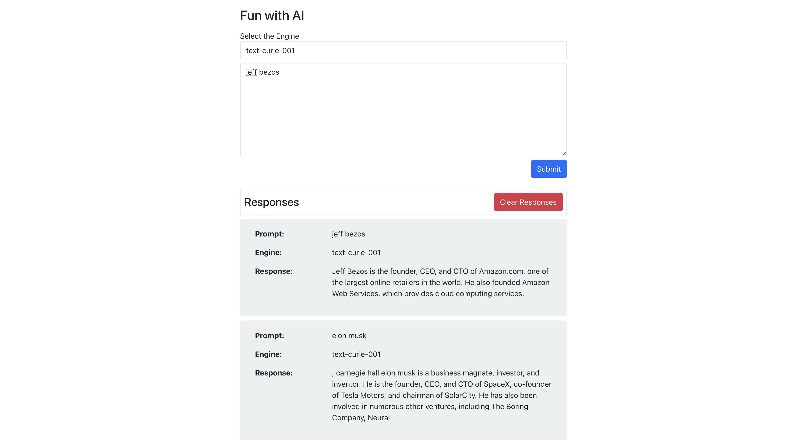

# Fun With AI
## Table of contents
* [Summary](#summary)
* [Technology](#technologies)
* [Visit Website](#visit-website)
* [Contact](#contact)

Welcome to Fun With AI 

 

<kbd>

</kbd>

## Summary
Buiding a Algorithm search website using Openai API

## Technologies

### Tools 
* Html
* SCSS
* Javascript
* bootstrap
* openai API
* react-bootstrap
* react hooks

## Visit Website
http://fun-with-ai.s3-website.us-east-2.amazonaws.com/

## Contact
Created by [Pau Thawn](https://www.linkedin.com/in/pau-thawn) 
Feel free to contact me for any questions! 

